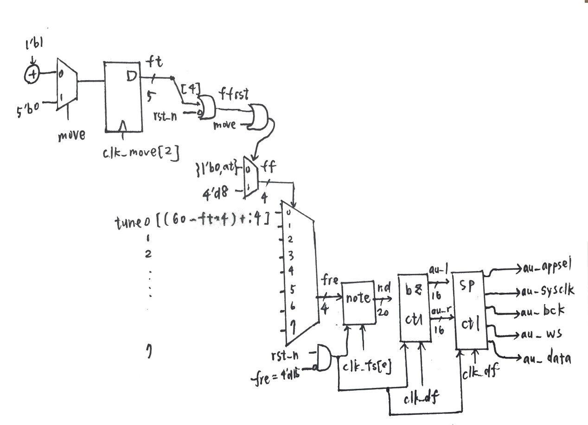
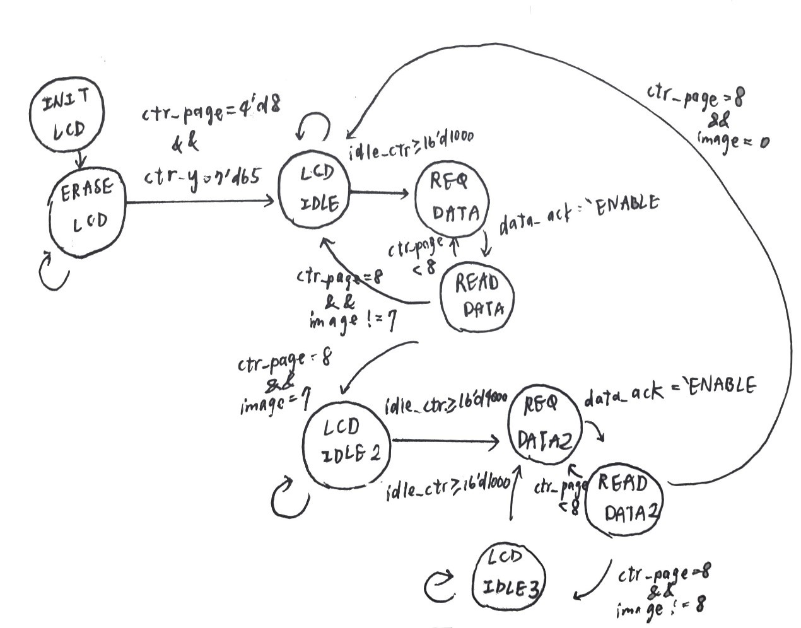
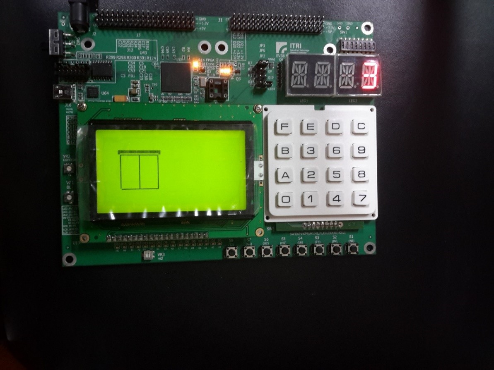
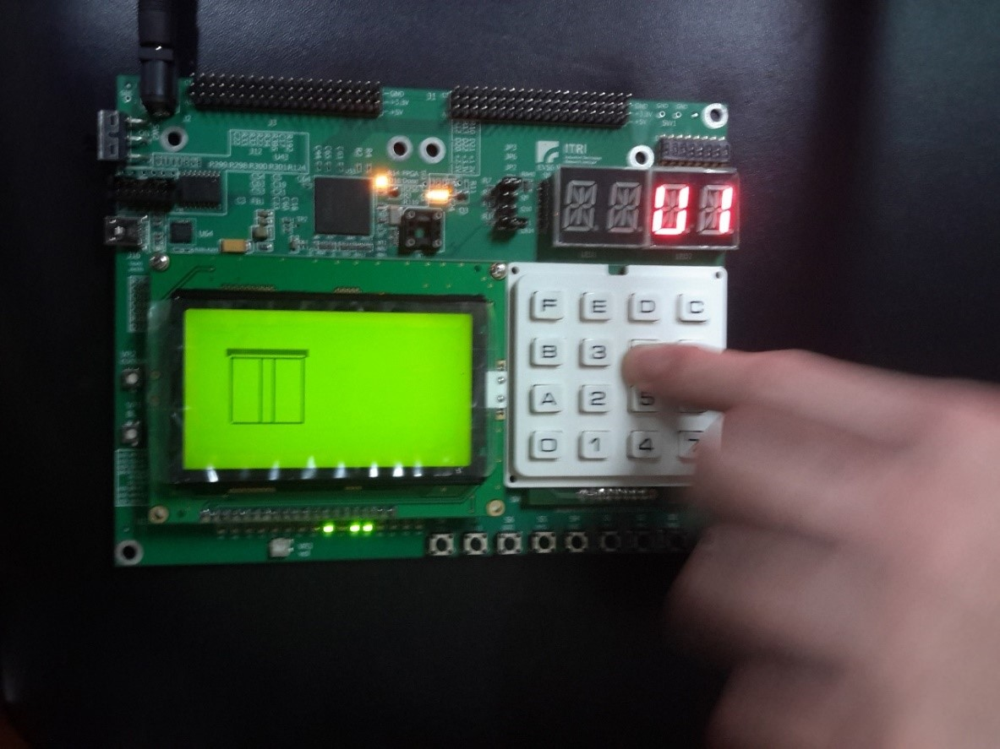
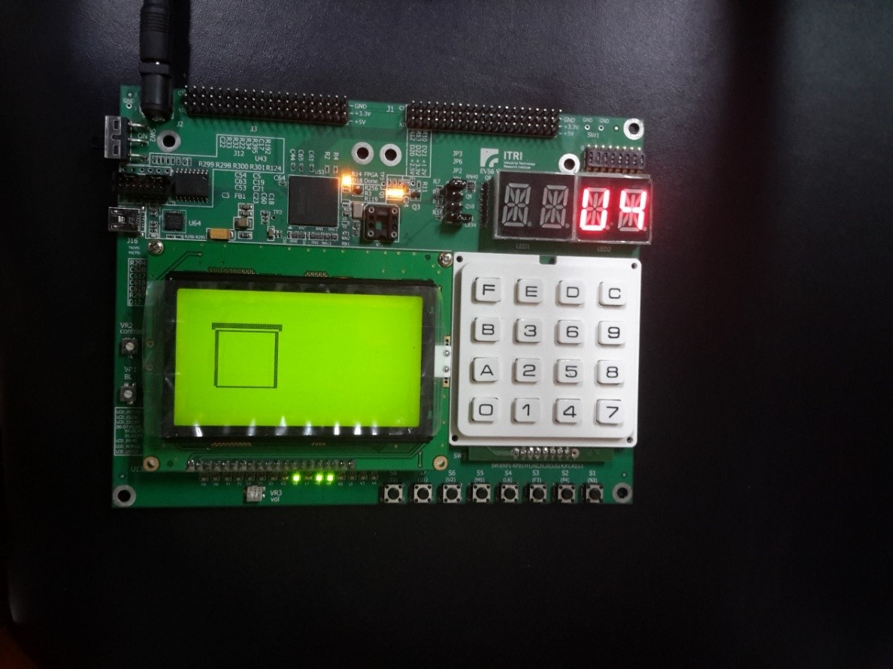
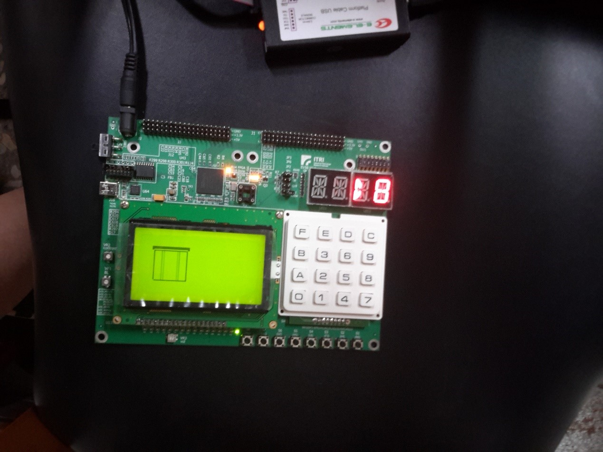
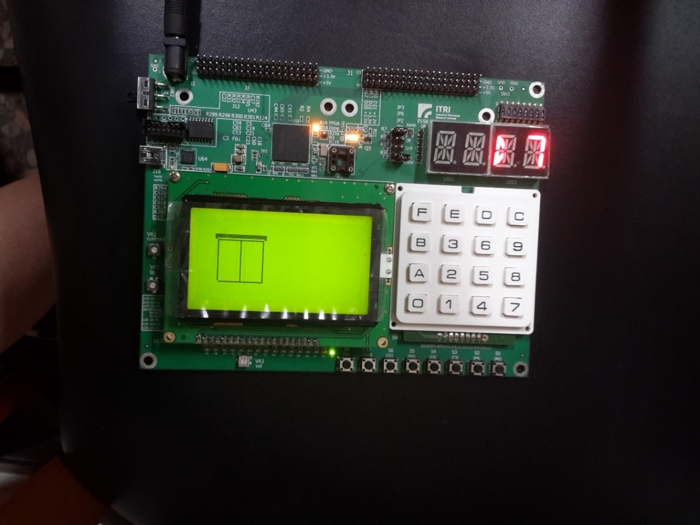
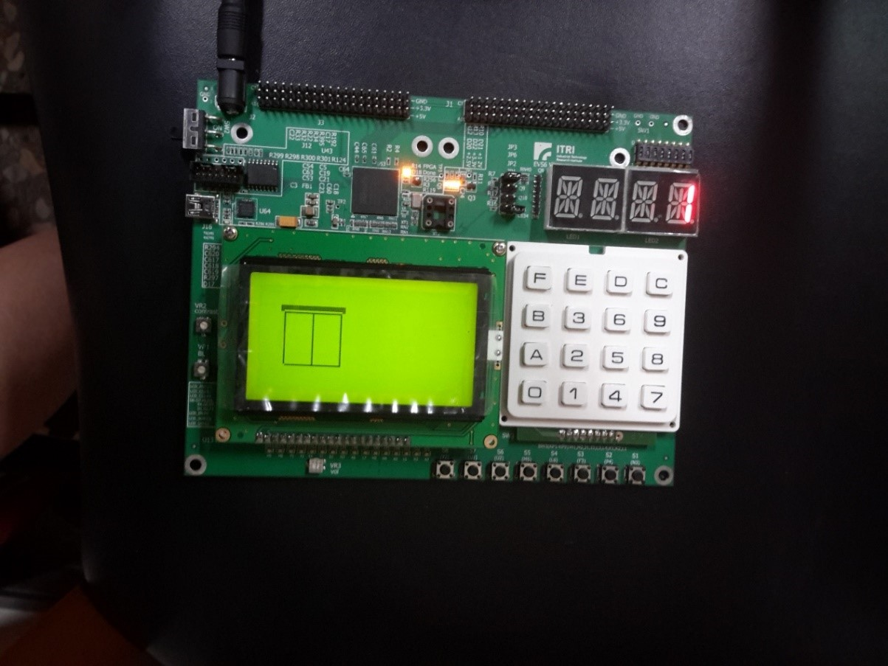

# Logic_Desigh_Lab
final project of Logic Design Lab

## Topic
Elevator

## Design Concept
We try to imitate elevator with the FPGA board.  
The elevator would be equipped with the following function:  
1. Show which floors the elevator is going to arrive;
2. Show which floor the elevator is currently at, and it is going up or down;
3. Both keypad and push buttons could control where the elevator should arrive;
4. Show opening or closing door animation;
5. Dip selection could control the speed of the elevator;
6. The elevator would sing different songs when arriving different floor

## Block Diagram of sound related modules

## State Diagram of LCD display

## Demo photos
  
Now the elevator is on standby on the third floor.  
    
  
Press some buttons, and the corresponding led would light up.  
    
  
“U” means that the elevator is currently going up, and the door is full open on the screen.  
    
  
This picture shows that the elevator is heading the ground floor. “D” is for down.  
    
  
The door is closed when the elevator is moving.  
    
  
The elevator arrived at ground floor. Before receiving next task, it would on standby.